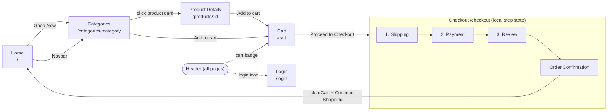
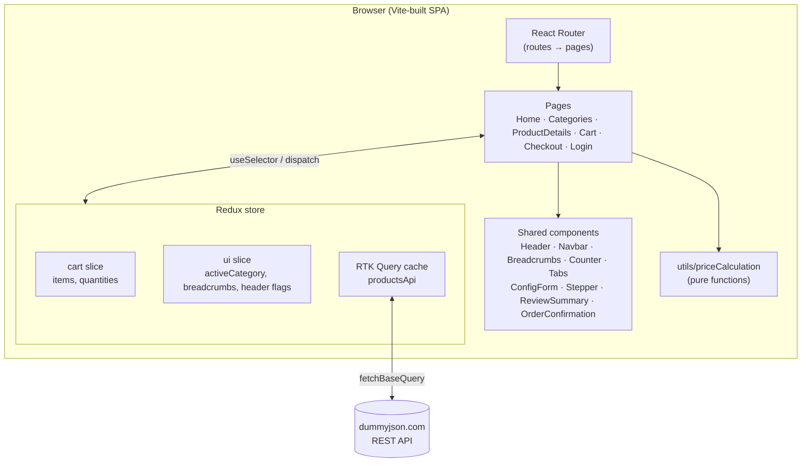

# ShopEase — Learning Shopping Cart

A client-side e-commerce storefront built with **React 19 + TypeScript + Redux Toolkit**. A shopper can browse categories, view product details, manage a cart, and walk through a 3-step checkout (shipping → payment → review) to a confirmation screen. Product data comes from the public [dummyjson.com](https://dummyjson.com) API; there is no custom backend.

> This is a learning project. Login and order placement are UI-only (no real auth, no persistence, no payment processing).

See also: [docs/WORKFLOW.md](docs/WORKFLOW.md) for detailed sequence/state diagrams, and the other design notes in [docs/](docs/).

---

## 1. High-level workflow



### Architecture at a glance



**Data flow rule of thumb:** server data → RTK Query cache; cross-page client state (cart, header/breadcrumb state) → Redux slices; everything only one screen cares about (checkout step, form values, validation errors) → local `useState`.

---

## 2. Technology choices — what and why

| Technology | Used for | Why this one |
|---|---|---|
| **React 19** | UI | Component model fits the page/shared-component split; hooks keep logic colocated. |
| **TypeScript** | Language | Shared `Product`, `RootState`, `FieldConfig` types catch shape errors (e.g. cart items extending `Product`) at compile time; `tsc -b` gates the build. |
| **Vite** | Dev server & bundler | Instant HMR and fast builds with near-zero config; first-class React plugin. |
| **React Router v7** | Client-side routing | Declarative `<Routes>`; URL params (`/categories/:category`) act as the source of truth for the selected category, enabling deep links. Router `location.state` passes the clicked product to the detail page to skip a refetch. |
| **Redux Toolkit** | Global state | The cart and header/breadcrumb state are read by many distant components (Header badge, Cart, Checkout, Navbar). Slices with Immer let reducers "mutate" safely; `configureStore` wires devtools and middleware. |
| **RTK Query** (`createApi`) | Server-state fetching | Replaces hand-written loading/error/caching code for `getCategories`, `getProductsByCategory`, `getProduct`. Results are cached per argument, so revisiting a category is instant. |
| **Tailwind CSS v4** | Styling foundation | Imported via `@import "tailwindcss"` in `index.css`; utility layer + preflight reset. |
| **Plain CSS per component + design tokens** | Component styling | Each component has its own `.css`; colors/spacing are CSS variables (OKLCH palette) in `index.css`, giving a consistent theme without a CSS-in-JS runtime. |
| **Config-driven forms** (`ConfigForm` + `validators.ts`) | Checkout forms | Fields are declared as data (`shippingFormConfig.ts`, `paymentFormConfig.ts`) with composable validators and conditional `showIf` rules, so adding a field or a new payment method needs no new JSX. |
| **ESLint** (+ `typescript-eslint`, `react-hooks`, `react-refresh`) | Code quality | Catches hook-rule violations and keeps Fast Refresh working. |

### Notable design decisions

- **Route-driven header.** `features/ui/headerConfig.ts` maps each route to which header parts show (search, navbar, breadcrumbs, cart, login). `Header` reads the config for the current path; pages can also override it with the `useHeaderConfig` hook. Checkout hides everything for a distraction-free flow.
- **Prices computed, not stored.** `utils/priceCalculation.ts` derives discounted price, subtotal, 8% tax and total from the cart on every render, so totals can never drift out of sync with items.
- **Checkout state stays local.** Step number and form values live in the `Checkout` component; only `clearCart` touches Redux when the order is placed.
- **Back-navigation only in the stepper.** Completed steps are clickable; future steps are not, so you can't skip validation.

---

## 3. Project structure

```
src/
├── main.tsx                 # Entry: BrowserRouter → Redux Provider → <App/>
├── App.tsx                  # Route table
├── app/store.ts             # configureStore: cart, ui, productsApi
├── features/
│   ├── cart/cartSlice.ts    # addToCart, removeFromCart, increment, decrement, clearCart
│   └── ui/                  # uiSlice, headerConfig (per-route), useHeaderConfig hook
├── services/productApi.ts   # RTK Query endpoints (dummyjson.com)
├── pages/
│   ├── Home/                # Hero + value-prop banner
│   ├── Categories/          # Sidebar categories + product grid (ProductCard)
│   ├── ProductDetails/      # Gallery, price, tabs (specs, reviews), add to cart
│   ├── Cart/                # Line items, quantity, totals
│   ├── Checkout/            # 3-step flow + form configs
│   └── Login/               # Sign In / Create Account tabs (UI only)
├── components/              # Header, Navbar, Breadcrumbs, Counter, Tabs,
│                            # ConfigForm, Stepper, ReviewSummary, OrderConfirmation
├── utils/priceCalculation.ts
└── types/categories.ts      # Product, Review, ProductDimensions
docs/                        # Design notes and workflow diagrams
```

## 4. Routes

| Path | Page | Header shows |
|---|---|---|
| `/` | Home | search, navbar, cart, login |
| `/categories`, `/categories/:category` | Categories (defaults to the first category) | search, breadcrumbs, cart, login |
| `/products/:id` | Product Details | search, breadcrumbs, cart, login |
| `/cart` | Cart | search, cart, login |
| `/checkout` | Checkout | nothing (focused flow) |
| `/login` | Login | login only |

## 5. Getting started

**Prerequisites:** Node.js (LTS) and npm.

```bash
npm install      # install dependencies
npm run dev      # dev server with HMR
npm run build    # type-check (tsc -b) + production build
npm run preview  # serve the production build locally
npm run lint     # ESLint
```

## 6. Known limitations / next steps

- No real authentication; Login form is presentational.
- Cart is in memory only — it is lost on refresh (candidate: persist the `cart` slice to `localStorage`).
- "Place Order" generates a random order ID client-side; no order API.
- Category sort dropdown, price filter and header search are not wired up yet.
- `ProductDetails` fetches with raw `fetch` when opened without router state; it could use `useGetProductQuery` for consistent caching.
- Shipping/tax are hard-coded (free shipping, 8% tax).
